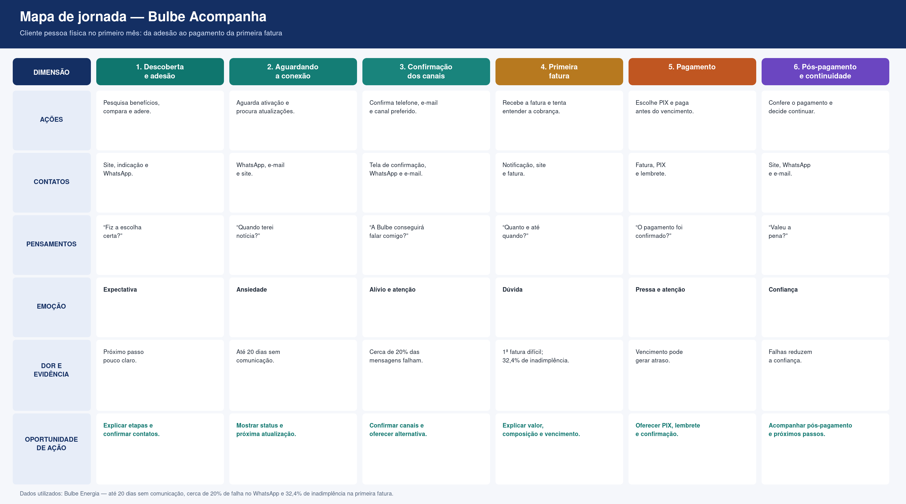

# Mapa de jornada do usuário

> Entregável da aula 19. A persona abaixo é fictícia e representa o cliente pessoa física no primeiro mês de relacionamento com a Bulbe Energia, com foco na compreensão e no pagamento da primeira fatura.

## Persona

- **Nome e idade:** Marina Alves, 29 anos
- **Contexto:** Conheceu a Bulbe por indicação, aderiu ao serviço pela internet e está no primeiro mês como cliente. Recebeu ou aguarda sua primeira fatura.
- **Objetivo:** Entender o valor, a composição e o vencimento da primeira fatura para escolher uma forma de pagamento e pagar dentro do prazo.
- **Medos e dúvidas:** Não entender a cobrança, não saber como o valor foi calculado, perder o vencimento, não saber utilizar o PIX ou não receber a confirmação do pagamento.
- **Canais que usa:** Site, WhatsApp e e-mail para consultar a fatura, receber lembretes e acompanhar o pagamento.

## Mapa

| Fase | Ações | Pontos de contato | Pensamentos | Emoção | Dor (com evidência da Bulbe) | Oportunidade |
| --- | --- | --- | --- | --- | --- | --- |
| Adesão e preparação | Realiza a adesão e aguarda as próximas informações da Bulbe. | Site, WhatsApp e e-mail. | “O que preciso fazer depois da adesão?” | Expectativa. | O cliente novo pode não saber quais serão os próximos passos. | Preparar o cliente para receber e entender a primeira fatura. |
| Recebimento da primeira fatura | Recebe a cobrança e acessa seus dados. | Site, e-mail e WhatsApp. | “Recebi a fatura, mas o que preciso pagar?” | Dúvida. | A inadimplência da primeira fatura chega a 32,4%. | Destacar o valor total, o vencimento e a situação da cobrança. |
| Entendimento da cobrança | Analisa o valor e a composição da fatura. | Tela da fatura e site. | “Como esse valor foi calculado?” | Insegurança. | A primeira fatura pode ser difícil de entender. | Explicar a composição da cobrança de forma simples. |
| Escolha do pagamento | Consulta as formas disponíveis para pagar. | Tela de pagamento e PIX. | “Qual é a forma mais fácil de pagar?” | Atenção. | A falta de orientação pode atrasar o pagamento. | Apresentar as opções de pagamento e destacar o PIX. |
| Pagamento | Realiza o pagamento antes do vencimento. | PIX, site e confirmação. | “O pagamento foi realizado?” | Pressa e preocupação. | O vencimento é um momento crítico para evitar atrasos. | Oferecer PIX, lembrete e confirmação do pagamento. |
| Pós-pagamento | Confere o pagamento e acompanha os próximos passos. | Site, WhatsApp e e-mail. | “Está tudo certo com minha conta?” | Alívio. | Sem confirmação, o cliente pode ficar inseguro. | Mostrar o status do pagamento e os próximos passos. |

## Oportunidades registradas como Issues

- [x] #8 Oportunidade — explicar a primeira fatura
- [x] #9 Oportunidade — facilitar o pagamento com PIX e lembretes
